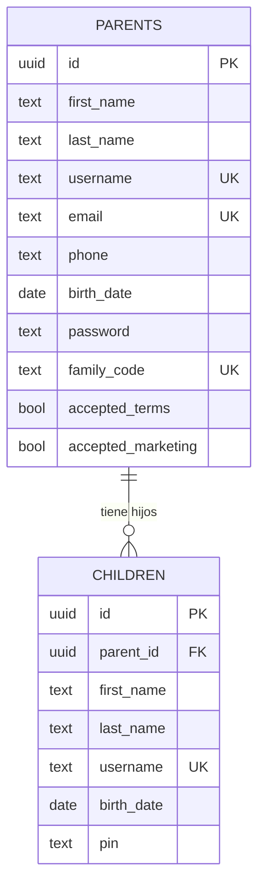
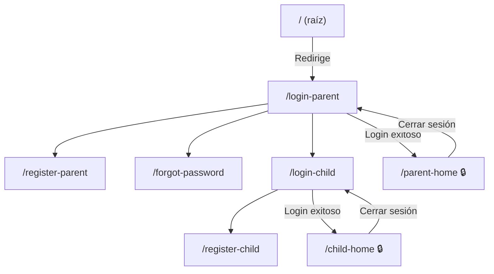

# 🏠 Análisis Completo del Proyecto — Domus

## ¿Qué es Domus?

**Domus** es una plataforma web de gestión familiar. Permite que **padres/madres** se registren, y luego vinculen a sus **hijos** mediante un **código familiar** único de 6 caracteres. La app tiene dos roles diferenciados con flujos de autenticación separados.

> [!NOTE]
> El proyecto está en fase inicial — tiene el sistema de autenticación y registro completo, pero las funcionalidades principales del "home" (gestión de tareas, etc.) aún están por implementarse.

---

## Stack Tecnológico

| Tecnología | Uso |
|---|---|
| **Vite** | Bundler / dev server |
| **React 19** | UI (JSX, hooks) |
| **React Router v7** | Navegación SPA con rutas protegidas |
| **Supabase** | Backend-as-a-Service (base de datos PostgreSQL) |
| **Vanilla CSS** | Estilos con tipografía Inter de Google Fonts |

---

## Arquitectura del Proyecto

```
domus/
├── index.html              ← Entry point HTML
├── vite.config.js          ← Configuración de Vite
├── package.json            ← Dependencias y scripts
└── src/
    ├── main.jsx            ← Monta React en el DOM
    ├── App.jsx             ← Router principal con todas las rutas
    ├── components/         ← Componentes reutilizables
    │   ├── Button.jsx
    │   ├── FormContainer.jsx
    │   ├── InputField.jsx
    │   └── ProtectedRoute.jsx
    ├── pages/              ← Páginas/vistas
    │   ├── LoginParent.jsx
    │   ├── LoginChild.jsx
    │   ├── RegisterParent.jsx
    │   ├── RegisterChild.jsx
    │   ├── ParentHome.jsx
    │   ├── ChildHome.jsx
    │   └── ForgotPassword.jsx
    ├── services/           ← Lógica de acceso a datos (Supabase)
    │   ├── supabase.js
    │   ├── parentService.js
    │   └── childService.js
    ├── utils/              ← Funciones auxiliares
    │   ├── auth.js
    │   ├── helpers.js
    │   └── validators.js
    └── styles/             ← Hojas de estilo
        ├── global.css
        └── forms.css
```

---

## Modelo de Datos (Supabase)



---

## Flujo de la Aplicación



### Flujo detallado de registro:

1. **Padre se registra** → se genera un `family_code` único de 6 caracteres alfanuméricos
2. **Padre comparte** ese código con su hijo(a) fuera de la app
3. **Hijo se registra** → ingresa el `family_code` → queda vinculado al padre vía `parent_id`

### Autenticación:

- **Padres**: login con username/email + contraseña
- **Hijos**: login con username + PIN de 4 dígitos
- La sesión se guarda en `localStorage` como JSON bajo la clave `domusUser`
- [ProtectedRoute](file:///Users/diegorobles/Desktop/domus/src/components/ProtectedRoute.jsx#4-21) verifica sesión + rol antes de renderizar páginas protegidas

---

## Detalle de Cada Archivo

### Componentes Reutilizables

| Componente | Función |
|---|---|
| [Button.jsx](file:///Users/diegorobles/Desktop/domus/src/components/Button.jsx) | Botón primario reutilizable con clase `.primary-btn` |
| [FormContainer.jsx](file:///Users/diegorobles/Desktop/domus/src/components/FormContainer.jsx) | Wrapper de tarjeta centrada con título y subtítulo |
| [InputField.jsx](file:///Users/diegorobles/Desktop/domus/src/components/InputField.jsx) | Campo de formulario controlado con label |
| [ProtectedRoute.jsx](file:///Users/diegorobles/Desktop/domus/src/components/ProtectedRoute.jsx) | Guard de ruta: redirige a login si no hay sesión o el rol no coincide |

### Páginas

| Página | Ruta | Descripción |
|---|---|---|
| [LoginParent.jsx](file:///Users/diegorobles/Desktop/domus/src/pages/LoginParent.jsx) | `/login-parent` | Login con username/email + contraseña |
| [LoginChild.jsx](file:///Users/diegorobles/Desktop/domus/src/pages/LoginChild.jsx) | `/login-child` | Login con username + PIN (4 dígitos) |
| [RegisterParent.jsx](file:///Users/diegorobles/Desktop/domus/src/pages/RegisterParent.jsx) | `/register-parent` | Formulario completo con validaciones (mayoría de edad, email, teléfono, etc.) |
| [RegisterChild.jsx](file:///Users/diegorobles/Desktop/domus/src/pages/RegisterChild.jsx) | `/register-child` | Registro de hijo con código familiar del padre |
| [ParentHome.jsx](file:///Users/diegorobles/Desktop/domus/src/pages/ParentHome.jsx) | `/parent-home` 🔒 | Dashboard básico con bienvenida y botón de logout |
| [ChildHome.jsx](file:///Users/diegorobles/Desktop/domus/src/pages/ChildHome.jsx) | `/child-home` 🔒 | Dashboard básico con bienvenida y botón de logout |
| [ForgotPassword.jsx](file:///Users/diegorobles/Desktop/domus/src/pages/ForgotPassword.jsx) | `/forgot-password` | Verifica si el email existe (sin envío real de correo aún) |

### Servicios

| Archivo | Funciones |
|---|---|
| [supabase.js](file:///Users/diegorobles/Desktop/domus/src/services/supabase.js) | Cliente Supabase compartido |
| [parentService.js](file:///Users/diegorobles/Desktop/domus/src/services/parentService.js) | [registerParent()](file:///Users/diegorobles/Desktop/domus/src/services/parentService.js#30-60), [loginParent()](file:///Users/diegorobles/Desktop/domus/src/services/parentService.js#61-85), [findParentByEmail()](file:///Users/diegorobles/Desktop/domus/src/services/parentService.js#86-104) + generador de código familiar único |
| [childService.js](file:///Users/diegorobles/Desktop/domus/src/services/childService.js) | [registerChild()](file:///Users/diegorobles/Desktop/domus/src/services/childService.js#18-44), [loginChild()](file:///Users/diegorobles/Desktop/domus/src/services/childService.js#45-68) + búsqueda de padre por family code |

### Utilidades

| Archivo | Funciones |
|---|---|
| [auth.js](file:///Users/diegorobles/Desktop/domus/src/utils/auth.js) | [saveUserSession()](file:///Users/diegorobles/Desktop/domus/src/utils/auth.js#1-5), [getUserSession()](file:///Users/diegorobles/Desktop/domus/src/utils/auth.js#6-11), [clearUserSession()](file:///Users/diegorobles/Desktop/domus/src/utils/auth.js#12-16) — manejo de `localStorage` |
| [helpers.js](file:///Users/diegorobles/Desktop/domus/src/utils/helpers.js) | [calculateAge()](file:///Users/diegorobles/Desktop/domus/src/utils/helpers.js#1-19), [generateFamilyCode()](file:///Users/diegorobles/Desktop/domus/src/utils/helpers.js#20-32) |
| [validators.js](file:///Users/diegorobles/Desktop/domus/src/utils/validators.js) | [isValidEmail()](file:///Users/diegorobles/Desktop/domus/src/utils/validators.js#1-5), [isAdult()](file:///Users/diegorobles/Desktop/domus/src/utils/validators.js#6-10), [isStrongPassword()](file:///Users/diegorobles/Desktop/domus/src/utils/validators.js#11-15), [isValidPhone()](file:///Users/diegorobles/Desktop/domus/src/utils/validators.js#16-20), [isValidPin()](file:///Users/diegorobles/Desktop/domus/src/utils/validators.js#21-25) |

---

## Validaciones Implementadas

### Registro de Padre
- Todos los campos obligatorios
- Email con formato válido
- Teléfono solo números (7-15 dígitos)
- Mayor de 18 años
- Contraseña mínimo 8 caracteres
- Confirmación de contraseña coincide
- Aceptar términos obligatorio
- Username y email únicos (validado por Supabase constraints)

### Registro de Hijo
- Todos los campos obligatorios
- Código familiar de exactamente 6 caracteres
- PIN de exactamente 4 dígitos
- Confirmación de PIN coincide
- Username único (validado por Supabase)

---

## Diseño Visual

- **Tipografía**: Inter (Google Fonts)
- **Color primario**: `#9420D4` (púrpura)
- **Color hover**: `#7d19b5`
- **Fondo**: `#f4f7fb` (gris claro)
- **Tarjetas**: blancas con `border-radius: 16px` y sombra sutil
- **Inputs**: bordes redondeados con animaciones de focus (scale + shadow púrpura)
- **Botón primario**: púrpura con animaciones hover (translateY + scale + shadow)

---

## Observaciones y Áreas de Mejora

> [!WARNING]
> Las contraseñas y PINs se almacenan en **texto plano** en Supabase. En producción se debería usar hashing (bcrypt o Supabase Auth).

> [!WARNING]
> La clave anónima de Supabase está expuesta directamente en el código fuente. Para producción, considerar variables de entorno.

### Funcionalidad pendiente:
- Los "home" de padre e hijo son básicos (solo muestran bienvenida)
- Falta la funcionalidad principal de gestión de tareas domésticas
- [ForgotPassword](file:///Users/diegorobles/Desktop/domus/src/pages/ForgotPassword.jsx#9-116) solo verifica el email pero no envía enlace real de recuperación
- No hay tests automatizados
- El [App.css](file:///Users/diegorobles/Desktop/domus/src/App.css) e [index.css](file:///Users/diegorobles/Desktop/domus/src/index.css) contienen estilos del template original de Vite que no se usan
